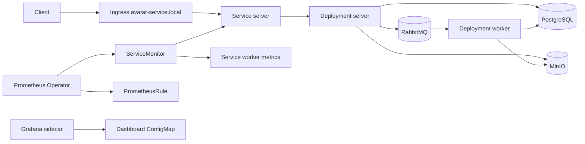

# Kubernetes deployment

Этот документ описывает Helm/Kubernetes слой для локальной сдачи `go-avatar-service`.
Текущий chart расположен в `deploy/helm/avatar-service` и по умолчанию поднимает приложение вместе с PostgreSQL, RabbitMQ и MinIO.

## Компоненты



## Runtime contract

- `server` запускается командой `avatars-service server`, слушает `HTTP_ADDR=:8080`, отдает `/health`, `/metrics`, API и web endpoints.
- `worker` запускается командой `avatars-service worker`, поднимает lightweight `/health` и Prometheus `/metrics` на `METRICS_ADDR=:9091`. Kubernetes probes используют `/health`; Prometheus scrape через ServiceMonitor остается на `/metrics`.
- Миграции выполняются отдельным Helm hook Job командой `avatars-service migrate up`.
- Конфигурация разделена на ConfigMap и Secret. Секреты используют фактические env names приложения: `POSTGRES_DSN`, `MINIO_ACCESS_KEY`, `MINIO_SECRET_KEY`, `RABBITMQ_URL`.
- Rate limiting и circuit breaker включены через env и могут быть настроены values-файлом.
- `config.rateLimitTrustForwardedHeaders` по умолчанию равен `"false"`: limiter bucket-ит по `RemoteAddr` и игнорирует `X-Forwarded-For`. Включайте его только если `server` недоступен напрямую, а trusted ingress/proxy перезаписывает forwarded headers перед передачей запроса в сервис.

## Local install

Сначала соберите image и загрузите его в локальный cluster runtime.

```bash
docker build -t avatar-service:latest .
```

Для `kind`:

```bash
kind load docker-image avatar-service:latest
```

Установка chart:

```bash
helm upgrade --install avatar-service ./deploy/helm/avatar-service \
  --namespace avatar-service \
  --create-namespace \
  -f ./deploy/helm/avatar-service/values-local.yaml
```

Проверка без Ingress:

```bash
kubectl -n avatar-service port-forward svc/avatar-service-server 18080:80
curl -fsS http://localhost:18080/health
curl -fsS http://localhost:18080/metrics
```

Если установлен ingress-nginx и настроен host:

```bash
curl -fsS -H 'Host: avatar-service.local' http://localhost/health
```

## Monitoring

`ServiceMonitor` выключен в `values-local.yaml`, потому что локальный кластер может не иметь CRD `monitoring.coreos.com/v1`.
Если Prometheus Operator установлен, включите ServiceMonitor и PrometheusRule:

```bash
helm upgrade --install avatar-service ./deploy/helm/avatar-service \
  --namespace avatar-service \
  -f ./deploy/helm/avatar-service/values-local.yaml \
  --set serviceMonitor.enabled=true \
  --set prometheusRule.enabled=true
```

Server scrape идет через service port `http` и path `/metrics`, worker scrape через service port `metrics` и path `/metrics`. Worker liveness/readiness probes ходят в process-level `/health` на том же metrics port.
Alert rules покрывают HTTP 5xx, upload errors, p95 latency, dependency errors, worker failures и отсутствие доступных Kubernetes replicas.

Chart также создает ConfigMap `avatar-service-grafana-dashboard` с label `grafana_dashboard=1`.
Он рассчитан на стандартный Grafana sidecar, который импортирует dashboard ConfigMap и отображает server/worker replicas, HTTP request rate, p95 latency, dependency errors и worker failures.
Панели с replicas и alert `AvatarServicePodsUnavailable` требуют `kube-state-metrics`.

## Security

- Application pods запускаются non-root пользователем `10001`.
- Container `securityContext` запрещает privilege escalation, сбрасывает Linux capabilities и включает read-only root filesystem.
- ServiceAccount не получает Kubernetes API permissions; Role пустой.
- NetworkPolicy ограничивает входящий трафик к `server` и `worker`, а egress оставляет DNS и доступ к локальным dependency pods.
- Secret хранит DSN и credentials; ConfigMap хранит только не чувствительную конфигурацию.
- Default chart не задает PostgreSQL/RabbitMQ пароли. Для production-like установки задайте `secret.postgresDsn` и `secret.rabbitmqUrl` либо явные `postgresql.password`, `rabbitmq.username` и `rabbitmq.password`; локальный `values-local.yaml` содержит только demo credentials.

## Production notes

Bundled PostgreSQL, RabbitMQ и MinIO предназначены для локальной/demo установки. Generated `POSTGRES_DSN` использует `postgresql.sslmode`, который по умолчанию равен `require`; локальный профиль `values-local.yaml` явно переключает его на `disable` для bundled PostgreSQL без TLS и задает demo PostgreSQL/RabbitMQ credentials. Для production-like окружения не используйте demo credentials из `values-local.yaml`: оставьте `postgresql.sslmode=require` и задайте полный `secret.postgresDsn` для managed PostgreSQL вместе с `secret.rabbitmqUrl`, MinIO endpoint и credentials, или задайте сильные explicit credentials и замените dependency templates на отдельные platform-owned charts.

## Acceptance checklist

Перед ревью проверьте локальный Kubernetes deployment:

```bash
docker build -t avatar-service:latest .
kind load docker-image avatar-service:latest
helm upgrade --install avatar-service ./deploy/helm/avatar-service \
  --namespace avatar-service \
  --create-namespace \
  -f ./deploy/helm/avatar-service/values-local.yaml
kubectl -n avatar-service rollout status deploy/avatar-service-server
kubectl -n avatar-service rollout status deploy/avatar-service-worker
kubectl -n avatar-service get job avatar-service-migrate
```

Проверка health, Ingress и load balancing:

```bash
kubectl -n avatar-service port-forward svc/avatar-service-server 18080:80
curl -fsS http://localhost:18080/health
curl -fsS http://localhost:18080/metrics
kubectl -n avatar-service get ingress avatar-service
kubectl -n avatar-service get endpoints avatar-service-server
```

Проверка масштабирования, безопасности и ресурсов:

```bash
kubectl -n avatar-service get hpa
kubectl top pods -n avatar-service
kubectl -n avatar-service get networkpolicy avatar-service
kubectl -n avatar-service get deploy avatar-service-server -o jsonpath='{.spec.template.spec.securityContext.runAsNonRoot}'
kubectl -n avatar-service get deploy avatar-service-server -o jsonpath='{.spec.template.spec.containers[0].resources}'
```

HPA требует работающий `metrics-server` / `metrics.k8s.io`. Если `kubectl -n avatar-service get hpa` показывает `cpu: <unknown>` и `memory: <unknown>`, autoscaling decision в этом кластере не проверяется, даже если HPA manifests корректны.

Если установлен Prometheus Operator:

```bash
helm upgrade --install avatar-service ./deploy/helm/avatar-service \
  --namespace avatar-service \
  -f ./deploy/helm/avatar-service/values-local.yaml \
  --set serviceMonitor.enabled=true \
  --set prometheusRule.enabled=true
kubectl -n avatar-service get servicemonitor,prometheusrule
kubectl -n avatar-service get configmap avatar-service-grafana-dashboard
```
